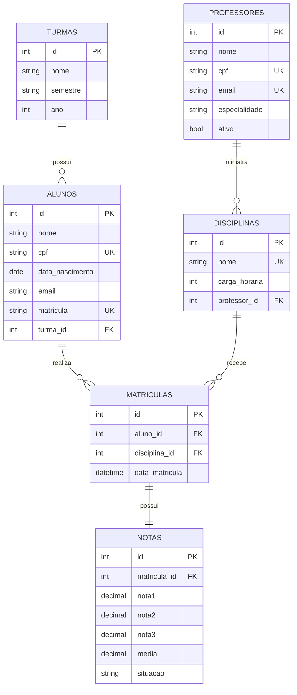

# DER

```mermaid
erDiagram
  TURMAS ||--o{ ALUNOS : possui
  PROFESSORES ||--o{ DISCIPLINAS : ministra
  ALUNOS ||--o{ MATRICULAS : realiza
  DISCIPLINAS ||--o{ MATRICULAS : recebe
  MATRICULAS ||--|| NOTAS : possui

  TURMAS {
    int id PK
    string nome
    string semestre
    int ano
  }
  ALUNOS {
    int id PK
    string nome
    string cpf UK
    date data_nascimento
    string email
    string matricula UK
    int turma_id FK
  }
  PROFESSORES {
    int id PK
    string nome
    string cpf UK
    string email UK
    string especialidade
    bool ativo
  }
  DISCIPLINAS {
    int id PK
    string nome UK
    int carga_horaria
    int professor_id FK
  }
  MATRICULAS {
    int id PK
    int aluno_id FK
    int disciplina_id FK
    datetime data_matricula
  }
  NOTAS {
    int id PK
    int matricula_id FK
    decimal nota1
    decimal nota2
    decimal nota3
    decimal media
    string situacao
  }
```
